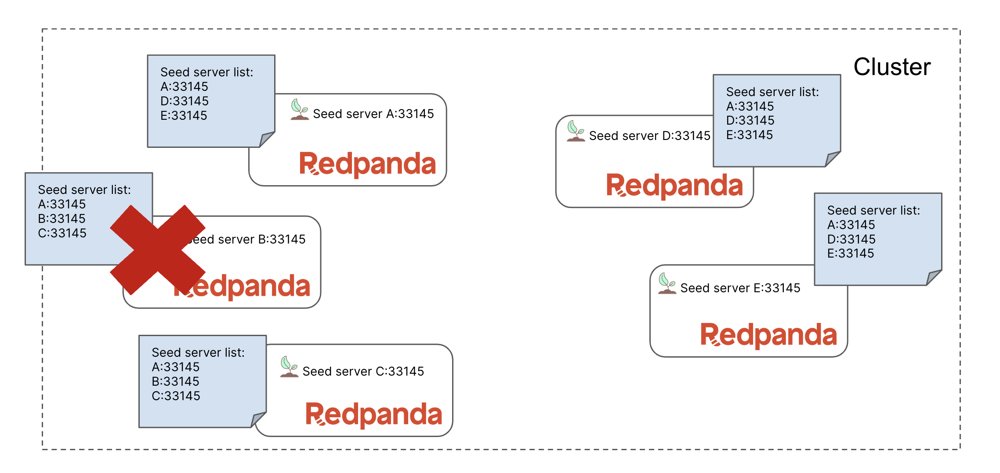
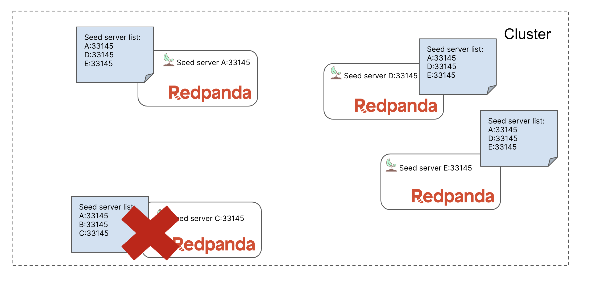
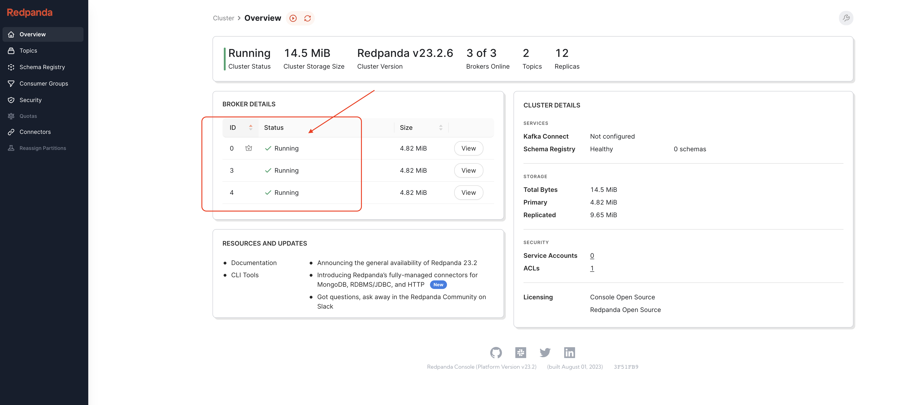
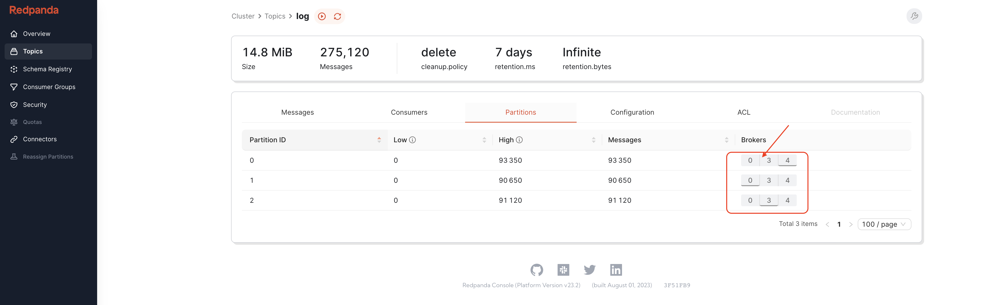

# Commissioning Redpanda Brokers

## Prerequisites

The following commands will install dependencies. The final script `delete-data.sh` will set ownership to the redpanda (UID 101) user and also clear the Redpanda data directory (to reset between runs):

```
# install rpk
curl -LO https://github.com/redpanda-data/redpanda/releases/latest/download/rpk-linux-amd64.zip
unzip rpk-linux-amd64.zip -d /usr/local/bin/
rm rpk-linux-amd64.zip

# config rpk
mv /etc/redpanda/rpk-config.yaml /etc/redpanda/redpanda.yaml

# install yq
wget https://github.com/mikefarah/yq/releases/latest/download/yq_linux_amd64 -O /usr/bin/yq && chmod +x /usr/bin/yq

# install jq
wget https://github.com/jqlang/jq/releases/download/jq-1.6/jq-linux32 -O /usr/bin/jq && chmod +x /usr/bin/jq

# fix ownership
./delete-data.sh
```

## Initial setup

Once prerequisite dependencies are installed, a few commands are needed in order to get your environment into the required state:

```
# enter working folder
cd  assets

# start 3 initial brokers
docker-compose \
-p 1-commissioning-brokers \
-f compose.redpanda-0.yaml \
-f compose.redpanda-1.yaml \
-f compose.redpanda-2.yaml \
-f compose.console.yaml \
up -d

# create topic
rpk topic create log -p 3 -r 3

# generate data
./generate-data.sh &
```

## Intro

> Note: The details below were originally created for killercoda. Any references to locations on the screen, output in various places, or clicking specific buttons won't be applicable when running locally.

*Here is a [link to our docs](https://docs.redpanda.com/docs/manage/cluster-maintenance/decommission-brokers/) on this topic.*

This scenario focuses on commissioning (adding/removing) brokers.

A popular reason for increasing a cluster's broker count is to expand the cluster's available resources. Conversely, a popular reason for decreasing the broker count is to save money on infrastructure costs over time. But this process should only be taken after considering several factors:

- Availability: do you have enough brokers to span across all racks and/or availability zones?
- Cost: infrastructure costs will be impacted by a change in broker count
- Data retention: storage capacity and possible retention values are determined in large part by the local disk capacity across all brokers
- Durability: you should have more brokers than your lowest partition replication factor
- partition count: this value is determined primarily by the CPU core count of the overall cluster

Right now a Redpanda cluster with 3 brokers is being deployed, along with Redpanda Console. Then a topic will be create with 3 partitions, each with 3 replicas. Finally a simple client (provided by `rpk`) will be started in the background to constantly produce data while you run through this scenario.

Click `Start` once you see that this process has completed (and you see a ready prompt).

## Step 1: Adding brokers

You will be replacing the cluster's brokers while keeping the cluster available for clients. A likely reason for this could be that you need to replace/upgrade the underlying physical/virtual hardware.

But do you know if you should first remove and then add a broker, or if you should add and then remove a broker? We'll call these two approaches "remove first" and "add first".

A cluster cannot reach majority consensus with two brokers (or any even number), so we should not drop below three brokers. Remember that we currently have three brokers!

The same rule applies to partition replicas. You can find your cluster's highest partition replica count using `rpk`:

```
rpk topic ls | awk '{print $3}' | grep -v REPLICAS | sort | tail -1
```

Our cluster currently has partitions with 3 replicas.

So we have eliminated the "remove first" approach for two reasons:

1. Our broker count would drop to two (an even number)
2. Decommissioning would never complete since there would be less brokers than the max number of partition replicas

So we must first add additional brokers to the cluster before removing the older brokers. We will add two new brokers at the same time to go to a 5-broker cluster, but you could choose to only add one broker at a time.


> Note: It is safe to **add** multiple brokers to a cluster without waiting because new brokers hold no partition data. But since existing brokers do hold data, you should only **remove** a single broker at a time.

Add the two additional brokers to the cluster:

```
docker-compose -p 1-commissioning-brokers -f compose.redpanda-3.yaml -f compose.redpanda-4.yaml up -d
```

Verify the cluster is now a healthy 5-broker cluster:

```
rpk cluster health
```

You'll see new nodes in the cluster:
```
CLUSTER HEALTH OVERVIEW
=======================
Healthy:                     true
Unhealthy reasons:           []
Controller ID:               0
All nodes:                   [0 1 2 3 4]
Nodes down:                  []
Leaderless partitions:       []
Under-replicated partitions: []
```

A cluster has seed servers to help it startup and join brokers correctly to the running cluster. You want to ensure that each broker in the cluster has the same seed server list, and that the list contains at least three entries (the more the better). You also want to make sure there is at least one seed server available at all times. More details [here](https://docs.redpanda.com/docs/deploy/deployment-option/self-hosted/manual/production/production-deployment/#configure-the-seed-servers).


Here is the current seed server list in the cluster:
```
docker exec -it redpanda-0.local cat /etc/redpanda/redpanda.yaml | yq '.redpanda.seed_servers'
```

The 2 additional brokers were added to the broker with an updated seed server list that contained themselves plus `redpanda-0`.


We will now apply this same update to the Redpanda configuration for `redpanda-0`:
```
./update-seeds.sh
```

Make sure the seed server list is updated in `redpanda-0`:
```
docker exec -it redpanda-0.local cat /etc/redpanda/redpanda.yaml | yq '.redpanda.seed_servers'
```


`redpanda-0` must be restarted for this change to take affect:

```
docker-compose -p 1-commissioning-brokers -f compose.redpanda-0.yaml restart
```

Now `redpanda-0`, `redpanda-3`, and `redpanda-4` share an identical seed server list that excludes the other two brokers. These are the two brokers that will be removed next.

## Step 2: Removing a broker



Decommission the first of the two old brokers, `redpanda-1`:

```
rpk redpanda admin brokers decommission 1
```

Check status of the decommission process (which may already be complete show and empty table):

```
rpk redpanda admin brokers decommission-status 1
```

The output will eventually include the following:

```
Node 1 is decommissioned successfully.
```

You can now see that no partitions have their replicas on `redpanda-1`:

```
rpk topic describe -p log
```

```
PARTITION  LEADER  EPOCH  REPLICAS  LOG-START-OFFSET  HIGH-WATERMARK
0          4       3      [0 3 4]   0                 56030
1          2       2      [0 2 3]   0                 54760
2          2       2      [2 3 4]   0                 54810
```

The `redpanda-1` container can now be stopped:

```
docker-compose -p 1-commissioning-brokers -f compose.redpanda-1.yaml stop
```

Now repeat the same decommission steps for `redpanda-2`:


Decommission `redpanda-2`:

```
rpk redpanda admin brokers decommission 2
```

Verify `redpanda-2` has completed decommission:

```
rpk redpanda admin brokers decommission-status 2
```

The output will eventually include the following:

```
Node 2 is decommissioned successfully.
```

Stop the `redpanda-2` container:

```
docker-compose -p 1-commissioning-brokers -f compose.redpanda-2.yaml stop
```

You can view cluster health and other details with [Redpanda Console]({{TRAFFIC_HOST1_8080}}/).

See broker status under cluster overview:



See location of partition replicas under _Topics>log>partitions_:



## Step 3: Challenge

You now have a cluster with 3 brokers, two of which have been replaced. In a real deployment, you could have been going through this process in order to upgrade the underlying hardware for each broker. If that were the case, then the next steps would be to follow the same process as above, but for `redpanda-0`:


1. add an additional broker `redpanda-5` with seeds `redpanda-3`, `redpanda-4`, and `redpanda-5`
2. update seeds on `redpanda-3` and `redpanda-4` to match `redpanda-5`
3. restart `redpanda-3` and `redpanda-4` one at a time (verifying cluster health after each broker comes back up)
4. update the `rpk` config in `/etc/redpanda/redpanda.yaml` to reference the kafka and admin ports for `redpanda-3`
5. decommission `redpanda-0` and then stop the container
6. (OPTIONAL) You might also want to edit the console configuration to point to the updated admin address.

Check if you passed the challenge:

```
bash check-challenge.sh
```

