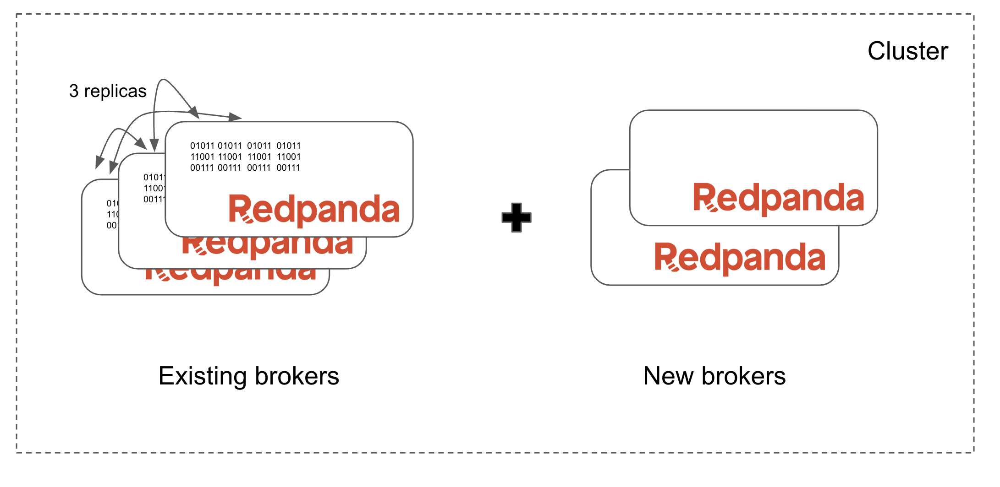
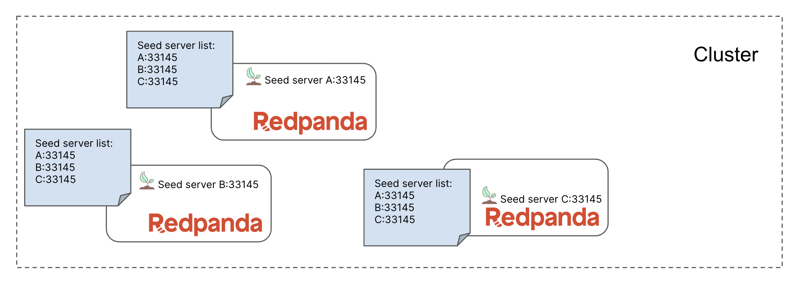
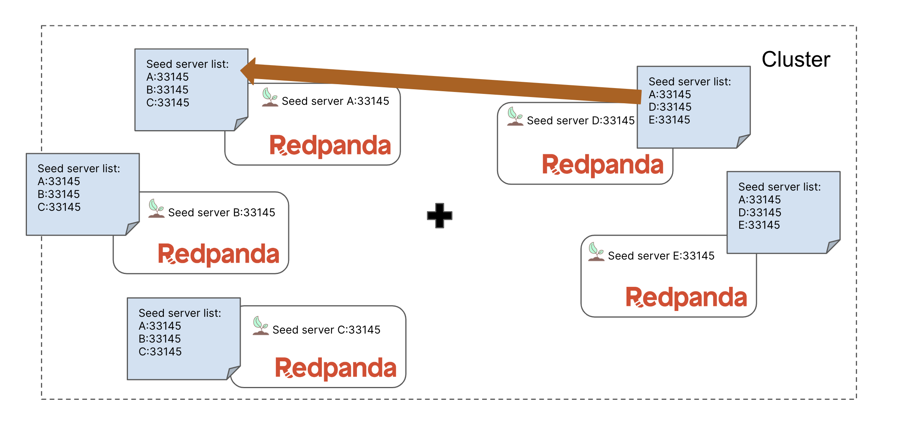

You will be replacing the cluster's brokers while keeping the cluster available for clients. A likely reason for this could be that you need to replace/upgrade the underlying physical/virtual hardware.

But do you know if you should first remove and then add a broker, or if you should add and then remove a broker? We'll call these two approaches "remove first" and "add first".

A cluster cannot reach majority consensus with two brokers (or any even number), so we should not drop below three brokers. Remember that we currently have three brokers!

The same rule applies to partition replicas. You can find your cluster's highest partition replica count using `rpk`:

```
rpk topic ls | awk '{print $3}' | grep -v REPLICAS | sort | tail -1
```{{exec}}

Our cluster currently has partitions with 3 replicas.

So we have eliminated the "remove first" approach for two reasons:

1. Our broker count would drop to two (an even number)
2. Decommissioning would never complete since there would be less brokers than the max number of partition replicas

So we must first add additional brokers to the cluster before removing the older brokers. We will add two new brokers at the same time to go to a 5-broker cluster, but you could choose to only add one broker at a time.



> Note: It is safe to **add** multiple brokers to a cluster without waiting because new brokers hold no partition data. But since existing brokers do hold data, you should only **remove** a single broker at a time.

Add the two additional brokers to the cluster:

```
docker-compose -p 1-commissioning-brokers -f compose.redpanda-3.yaml -f compose.redpanda-4.yaml up -d
```{{exec}}

Verify the cluster is now a healthy 5-broker cluster:

```
rpk cluster health
```{{exec}}

You'll see new nodes in the cluster:
```
CLUSTER HEALTH OVERVIEW
=======================
Healthy:                     true
Unhealthy reasons:           []
Controller ID:               0
All nodes:                   [0 1 2 3 4]
Nodes down:                  []
Leaderless partitions:       []
Under-replicated partitions: []
```

A cluster has seed servers to help it startup and join brokers correctly to the running cluster. You want to ensure that each broker in the cluster has the same seed server list, and that the list contains at least three entries (the more the better). You also want to make sure there is at least one seed server available at all times. More details [here](https://docs.redpanda.com/docs/deploy/deployment-option/self-hosted/manual/production/production-deployment/#configure-the-seed-servers).



Here is the current seed server list in the cluster:
```
docker exec -it redpanda-0.local cat /etc/redpanda/redpanda.yaml | yq '.redpanda.seed_servers'
```{{exec}}


The 2 additional brokers were added to the broker with an updated seed server list that contained themselves plus `redpanda-0`.


We will now apply this same update to the Redpanda configuration for `redpanda-0`:
```
./update-seeds.sh
```{{exec}}

Make sure the seed server list is updated in `redpanda-0`:
```
docker exec -it redpanda-0.local cat /etc/redpanda/redpanda.yaml | yq '.redpanda.seed_servers'
```{{exec}}


`redpanda-0` must be restarted for this change to take affect:

```
docker-compose -p 1-commissioning-brokers -f compose.redpanda-0.yaml restart
```{{exec}}

Now `redpanda-0`, `redpanda-3`, and `redpanda-4` share an identical seed server list that excludes the other two brokers. These are the two brokers that will be removed next.

