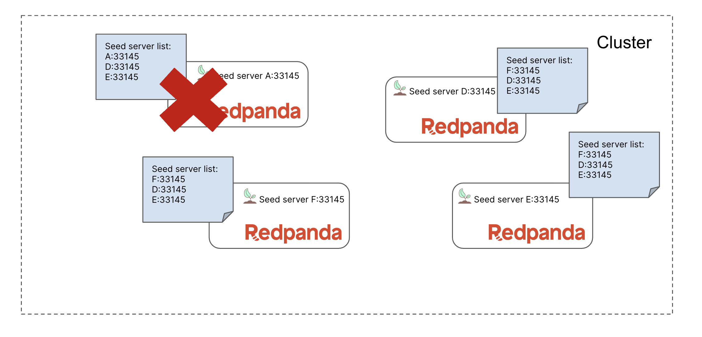

You now have a cluster with 3 brokers, two of which have been replaced. In a real deployment, you could have been going through this process in order to upgrade the underlying hardware for each broker. If that were the case, then the next steps would be to follow the same process as above, but for `redpanda-0`:


1. add an additional broker `redpanda-5` with seeds `redpanda-3`, `redpanda-4`, and `redpanda-5`
2. update seeds on `redpanda-3` and `redpanda-4` to match `redpanda-5`
3. restart `redpanda-3` and `redpanda-4` one at a time (verifying cluster health after each broker comes back up)
4. decommission `redpanda-0` and then stop the container
5. (OPTIONAL) You might also want to edit the console configuration to point to the updated admin address.

Check if you passed the challenge:
```
bash check-challenge.sh
```{{exec}}