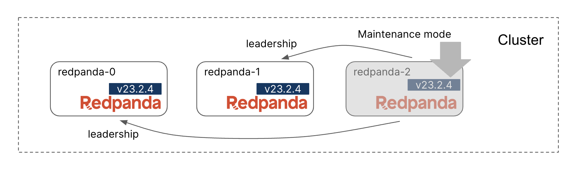
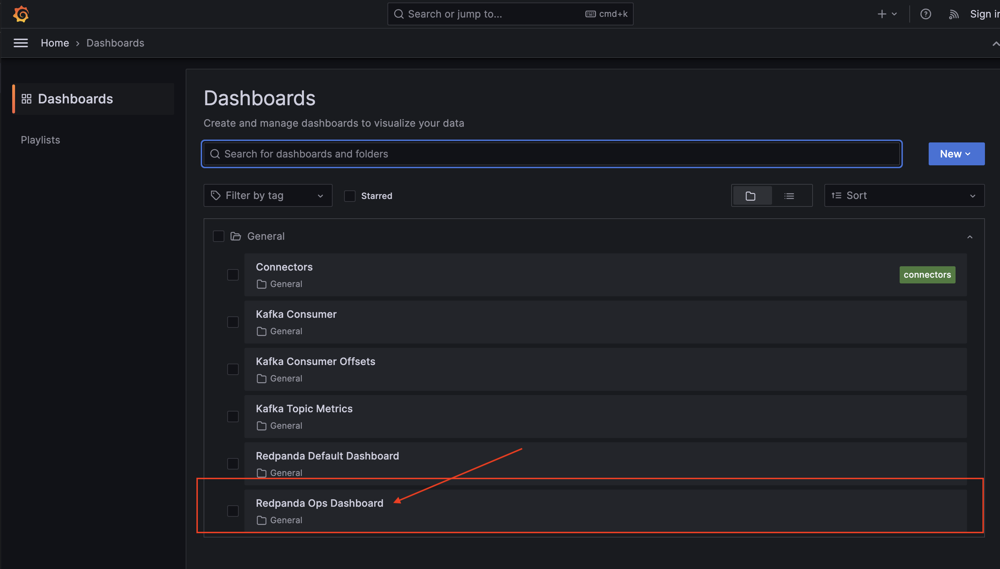
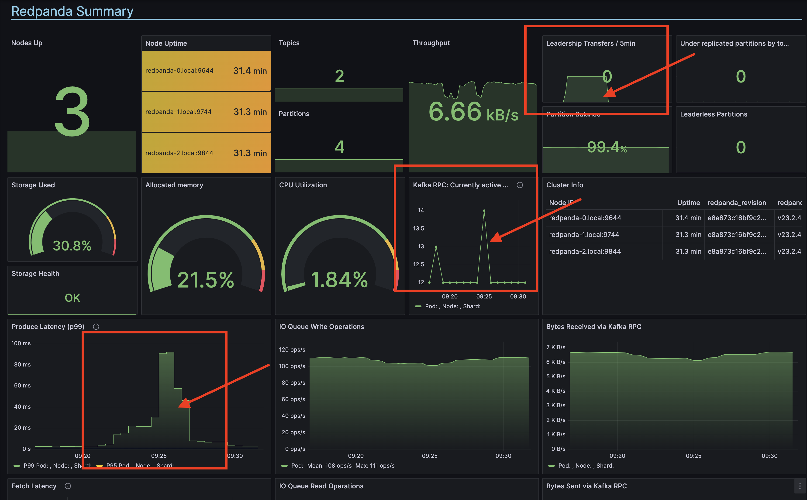

Now you know that you want to upgrade to `v23.2.5`. The first step is to put the target broker into maintenance mode. The maintenance mode allows you to briefly take a Redpanda node offline, ensuring client operations face minimal interruptions.

First verify the cluster is healthy:

```
rpk cluster health
```{{exec}}

A broker should be put into maintenance mode before applying an upgrade. When under maintenance mode, Redpanda shifts partition leadership to other cluster nodes.
More details on what maintenance mode is, what it is used for, other details are found in [this page](https://docs.redpanda.com/docs/manage/node-management/) in our docs.


Take a look at all partition leaders for Topic log: 
```
rpk topic describe log -p | awk '{printf("%10s%10s\n"), $1,$2}'
```{{exec}}

You'll see that each partition is assigned to different leader node:
```
 PARTITION    LEADER
         0         1
         1         2
         2         0
```

We will now put `redpanda-2` into maintenance mode:

```
rpk cluster maintenance enable 2 --wait
```{{exec}}



You can check the maintenance status with the following command:

```
rpk cluster maintenance status
```{{exec}}

The output shows that `DRAINING`/`FINISHED` for broker 2 is `true`/`true`:

```
NODE-ID  DRAINING  FINISHED  ERRORS  PARTITIONS  ELIGIBLE  TRANSFERRING  FAILED
0        false     false     false   0           0         0             0
1        false     false     false   0           0         0             0
2        true      true      false   1           0         0             0
```

> Note: The output above shows a value of `1` in the `PARTITIONS` column for broker 2. Your output may show a different partition count, as this is the number of leader partitions located on this broker.

Take a look at all partition leaders for Topic log again: 
```
rpk topic describe log -p | awk '{printf("%10s%10s\n"), $1,$2}'
```{{exec}}

You'll see that each partition is assigned to different leader node :
```
 PARTITION    LEADER
         0         1
         1         1
         2         0
```


The cluster will continue to report as healthy, and clients will be able to connect. You can verify cluster health again:

```
rpk cluster health
```{{exec}}

Now check grafana for any issues: [Grafana]({{TRAFFIC_HOST1_3000}}/dashboards)

Open the dashboard at `Dashboards > General > Redpanda Ops Dashboard`.


It is normal to see changes in metrics such as:
- increase in leadership transfers
- nominally higher latencies
- nominally higher resource (CPU/memory) usage




These normal behaviors should appear and then gradual return to lower values once the cluster completes with handling the maintenance change on the broker. Rather than focus on these changes above, try to focus on areas like the following:
- high spikes in latency
- high spikes in CPU usage
- leaderless partitions
- under-replicated partitions

Now `redpanda-2` is in maintenance mode, the cluster is healthy, metrics are showing no issues in Grafana, and we are ready to upgrade.

