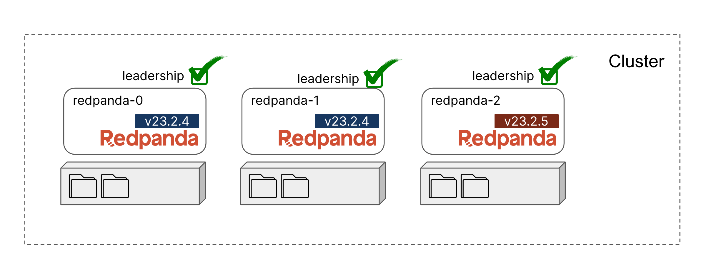

Upgrade process is different depending on your platform. These steps follow the Docker platform steps. See [our docs](https://docs.redpanda.com/docs/manage/cluster-maintenance/rolling-upgrade/#upgrade-your-version) for steps to take on other platforms.

The steps below provide some convenience scripts to make sure each step is less prone to error and to be more focused on what you are doing by running each command (rather than the Docker environment). Feel free to look at the contents of any script to get more details on exactly what is being done under the covers.

First stop `redpanda-2` broker:

```
./stop-broker.sh redpanda-2
```{{exec}}


Then update `redpanda-2` to version `23.2.5`. The following command runs a convenience script that edits the Docker compose file responsible for `repanda-2` to make use of `v23.2.5`:

```
./update-version.sh redpanda-2 v23.2.5
```{{exec}}

Start `redpanda-2` with the updated version:

```
docker-compose -p 2-rolling-upgrade -f compose.redpanda-2.yaml up -d
```{{exec}}

Check following metrics in [Grafana]({{TRAFFIC_HOST1_3000}}/dashboards) at `Dashboards > General > Redpanda Ops Dashboard` :

|  Metric	 |  Description  | 
| ----------------------------------------- | ----------------------------------------- |
| redpanda_kafka_under_replicated_replicas | If this shows any non-zero value, then replication cannot catch up, and the upgrade should be paused. |
| redpanda_cluster_unavailable_partitions | Before restart, wait for this to show zero unavailable partitions. |
| redpanda_kafka_request_bytes_total | Before restart, the produce and consume rate for each broker should recover to the pre-upgrade value. |
| redpanda_kafka_request_latency_seconds | Before restart, the p99 histogram should recover to the pre-upgrade value. |
| redpanda_rpc_request_latency_seconds | Before restart, the p99 histogram should recover to the pre-upgrade value. |
| redpanda_cpu_busy_seconds_total | Check the CPU utilization. The derivative gives you a 0.0-1.0 value for how much time the core was busy in a given second. |


Verify that `redpanda-2` is now at `v23.2.5`:

```
rpk redpanda admin brokers list
```{{exec}}

```
NODE-ID  NUM-CORES  MEMBERSHIP-STATUS  IS-ALIVE  BROKER-VERSION
0        1          active             true      v23.2.4 - e8a873c16bf9c25132859b55bd9ea6acb901a496
1        1          active             true      v23.2.4 - e8a873c16bf9c25132859b55bd9ea6acb901a496
2        1          active             true      v23.2.5 - c16a796c0ac5087e1a05ae3ba66bed101e305126
```



Bring `redpanda-2` out of maintenance mode:

```
rpk cluster maintenance disable 2
```{{exec}}

Verify no brokers are in maintenance mode:
```
rpk cluster maintenance status
```{{exec}}

```
NODE-ID  DRAINING  FINISHED  ERRORS  PARTITIONS  ELIGIBLE  TRANSFERRING  FAILED
0        false     false     false   0           0         0             0
1        false     false     false   0           0         0             0
2        false     false     false   0           0         0             0
```

Verify cluster health:

```
rpk cluster health
```{{exec}}


Now that `redpanda-2` is back in service, it is eligible for partition leadership again. Take a look at all partition leaders for Topic log: 
```
rpk topic describe log -p | awk '{printf("%10s%10s\n"), $1,$2}'
```{{exec}}

You'll see that each partition is assigned to different leader node (assigned node can be varied, it'll take a few minutes to reelect leaders.):
```
 PARTITION    LEADER
         0         1
         1         2
         2         0
```

Click `Next` to continue to with the next steps.

