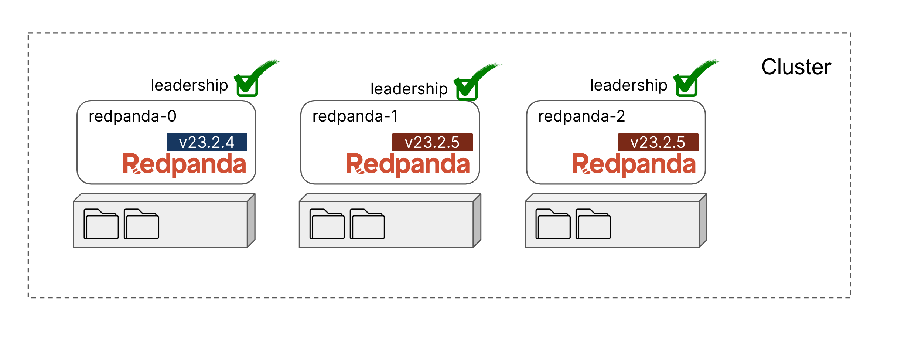

We can now continue upgrading the remaining brokers `redpanda-1`, and here is a little challenge for you. Try continue upgrading the broker.



Some hint:

 - Check the cluster health
 - Put redpanda-1 in maintenance mode, always check it's status
 - Stop the broker by running `bash stop-broker.sh redpanda-1` 
 - Update the broker version by running `bash update-version.sh redpanda-1 v23.2.5` 
 - Start up the new broker by running `docker-compose -p 2-rolling-upgrade -f compose.redpanda-1.yaml up -d`
 - Put redpanda-1 back online

Verify you can verify that `redpanda-1` broker is upgraded to `v23.2.5`:

```
rpk redpanda admin brokers list
```{{exec}}

```
NODE-ID  NUM-CORES  MEMBERSHIP-STATUS  IS-ALIVE  BROKER-VERSION
0        1          active             true      v23.2.4 - e8a873c16bf9c25132859b55bd9ea6acb901a496
2        1          active             true      v23.2.5 - c16a796c0ac5087e1a05ae3ba66bed101e305126
1        1          active             true      v23.2.5 - c16a796c0ac5087e1a05ae3ba66bed101e305126
```
Click `Next` to continue to with the final steps.