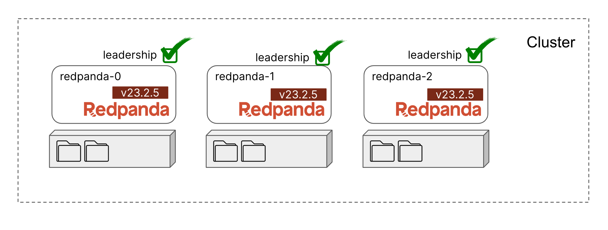

We can now continue upgrading the remaining brokers `redpanda-0`. When working with large clusters, it's normal that we automated this process, run the following command that automatically upgrades `redpanda-0`.




> Note: We have repurpose the from last steps for automation, you are welcome to use whatever automation tools thar works for you, run the automation script, it will automatically upgrade `redpanda-0` for you.

```
bash automate.sh
```{{exec}}

Take a look at the automation script, see if how that applies to your environment?:

```
#!/bin/bash

echo -n  "Checking cluster health"
for i in {1..5}; do echo  -n ".."; sleep 0.5; done

echo ""
if [[ $(rpk cluster health |  grep 'down' |grep -oP '(?<=\[).*(?=])' | wc -c) -ne 0 ]]; then
    echo "Cluster not healthy, cannot upgrade until resolved, run rpk cluster health for more info.. "
    exit;
fi

echo -n "Enabling maintenance for node "
for i in {1..5}; do echo  -n ".."; sleep 0.5; done
echo ""
rpk cluster maintenance enable 0

echo ""
echo -n "Check if maintenance succesd.."
while ! rpk cluster maintenance status | awk 'NR==2{ print; }' | awk '{print $2 $3 $4}'| grep truetruefalse; do
  echo  -n ".."
  sleep 1;
done

echo ""
echo -n  "Checking cluster health"
for i in {1..5}; do echo  -n ".."; sleep 0.5; done

if [[ $(rpk cluster health |  grep 'down' |grep -oP '(?<=\[).*(?=])' | wc -c) -ne 0 ]]; then
    echo "Cluster not healthy, cannot upgrade until resolved, run rpk cluster health for more info.. "
    exit;
fi

echo ""
echo -n "Stopping Redpanda "
for i in {1..5}; do echo  -n ".."; sleep 0.5; done
echo ""
bash stop-broker.sh redpanda-0

echo ""
echo -n "Updating Redpanda version "
for i in {1..5}; do echo  -n ".."; sleep 0.5; done
echo ""
bash update-version.sh redpanda-0 v23.2.5

echo ""
echo -n "Restarting Redpanda "
for i in {1..2}; do echo  -n ".."; sleep 0.5; done
echo ""
docker-compose -p 2-rolling-upgrade -f compose.redpanda-0.yaml up -d

echo ""
echo -n "Check cluster status.."
while ! docker container inspect -f '{{.State.Running}}' redpanda-0.local; do
  echo  -n ".."
  sleep 1;
done

echo ""
echo -n "Bringing node back online"
for i in {1..2}; do echo  -n ".."; sleep 0.5; done
echo ""
rpk cluster maintenance disable 0


echo -n "Check online status.."
while ! rpk cluster maintenance status | awk 'NR==2{ print; }' | awk '{print $2 $3 $4}'| grep falsefalsefalse; do
  echo  -n ".."
  sleep 1;
done

echo ""
echo "Current cluster version:"
for i in {1..2}; do echo  -n ".."; sleep 0.5; done
echo ""
rpk redpanda admin brokers list

echo -n "Node upgrade successful"
```

Finally, you can verify that all brokers are upgraded to `v23.2.5`:

```
rpk redpanda admin brokers list
```{{exec}}

```
NODE-ID  NUM-CORES  MEMBERSHIP-STATUS  IS-ALIVE  BROKER-VERSION
0        1          active             true      v23.2.5 - c16a796c0ac5087e1a05ae3ba66bed101e305126
1        1          active             true      v23.2.5 - c16a796c0ac5087e1a05ae3ba66bed101e305126
2        1          active             true      v23.2.5 - c16a796c0ac5087e1a05ae3ba66bed101e305126
```