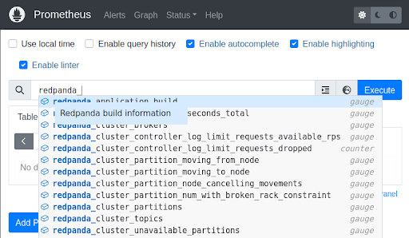

- [Redpanda Console]({{TRAFFIC_HOST1_8080}}/)
- [Prometheus ]({{TRAFFIC_HOST1_9090}}/)
- [Grafana]({{TRAFFIC_HOST1_3000}}/)
- [MailHog]({{TRAFFIC_HOST1_8025}}/)


# Prometheus

## Verify connectivity to Redpanda

Prometheus is configured to connect to each of the Redpanda brokers. View the configuration file for this environment:

```
cat observability/demo/config/prometheus/prometheus.yml
```{{exec}}

In this file, the `scrape_configs` section has a job `redpanda`, and the static config targets list each of the 3 brokers. Prometheus will need to be updated over time as you commission/decommission new brokers.

Open the [Prometheus Console]({{TRAFFIC_HOST1_9090}}/) and start typing `redpanda_` in the expression input field.



You should see Redpanda metrics in the dropdown list.

For the following steps we will monitor the 

## Prometheus visualization

## Prometheus alerting

## Create a new alert
