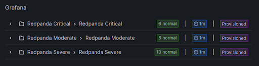
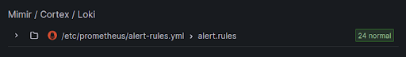
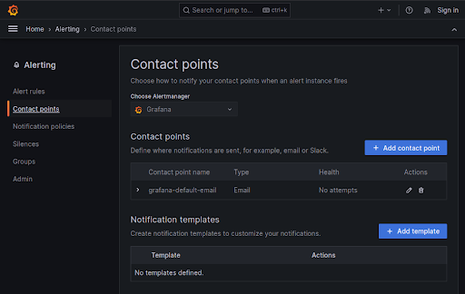
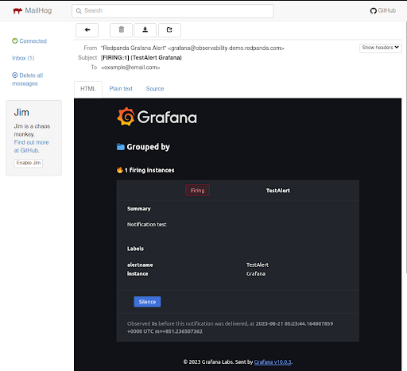

# Viewing alerts

## Alert definition file

The [alert-definitions file](./config/alert-definitions.yml) is used to define alerts for either Prometheus or Grafana. Once you have found the Redpanda metrics you determined the alert you want, you can modify this file with the definition for your rule and then run [a python script](./alert-generation/generate.py) we provide to generate alert config files for Prometheus and/or Grafana. More details on how to run this script are in this [README](https://github.com/redpanda-data/observability/blob/main/alert-generation/README.md).

> Note: In a production deployment you will likely only want to use alerting from one of these tools, but in this environment alerts are generated and used in both tools.

Later in this scenario we will modify this file to create a new alert. For now let's continue exploring Prometheus and Grafana.

## View alerts in Prometheus

The [Prometheus alerts]({{TRAFFIC_HOST1_9090}}/alerts) page shows the status and details for each alert. If you wanted to modify these alerts, you would edit the [alert-rules file](./config/prometheus/alert-rules.yml) and then restart Prometheus. Remember that the alert-generation script mentioned above can generate this file for you! We will leave these alerts at their default values for now.

## View alerts in Grafana

The [Grafana alerts]({{TRAFFIC_HOST1_3000}}/alerting/list) page shows alerts defined in the Grafana config:

But if you have configured Prometheus alerts they will also show up here:

This environment has alerts configured in both Prometheus and Grafana to show how they are configured, but in a production environment you would only want to have one set of alerts.

> Note: You can only silence Grafana alerts here (not the alerts for Prometheus). Silencing alerts ensures no notifications will be sent out for any matching alerts. This does not mean the alerts won't continue to fire in Grafana!

## Send test email

When an alert fires, a notification can be sent to various contact points. This environment has a default email contact point configured [here]({{TRAFFIC_HOST1_3000}}/alerting/notifications)

Click the edit action button, click the "Test" button, and then click "Send test notification". This will fire off an email to that you can read in your [inbox]({{TRAFFIC_HOST1_8025}}/).

## Explore metrics

Grafana is already populated with several good charts for monitoring Redpanda. It's likely that the metrics you care about are already being used on one of these dashboards to provide an interesting visualization.

More details on these charts are available [here](https://github.com/redpanda-data/observability) and [here](https://docs.redpanda.com/docs/manage/monitoring/#use-redpanda-monitoring-examples).

But what if you want to create a visualization for yourself? Let's create a new chart that tracks a useful metric: disk used.
