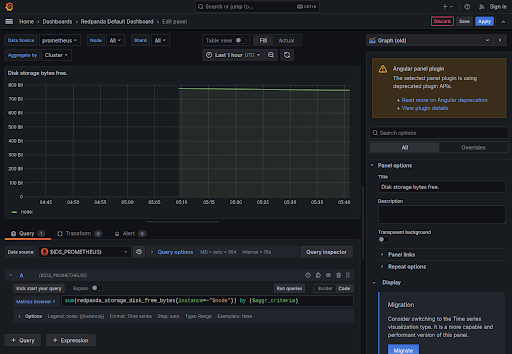

# Viewing alerts

## Alert definition file

The [alert-definitions file](./config/alert-definitions.yml) is used to define alerts for either Prometheus or Grafana. Once you have found the Redpanda metrics you determined the alert you want, you can modify this file with the definition for your rule and then run [a python script](./alert-generation/generate.py) we provide to generate alert config files for Prometheus and/or Grafana. More details on how to run this script are in this [README](https://github.com/redpanda-data/observability/blob/main/alert-generation/README.md).

> Note: In a production deployment you will likely only want to use alerting from one of these tools, but in this environment alerts are generated and used in both tools.

Later in this scenario we will modify this file to create a new alert. For now let's continue exploring Prometheus and Grafana.

## View Prometheus alerts

The [Prometheus alerts]({{TRAFFIC_HOST1_9090}}/alerts) page shows the status and details for each alert. If you wanted to modify these alerts, you would edit the [alert-rules file](./config/prometheus/alert-rules.yml) and then restart Prometheus. Remember that the alert-generation script mentioned above can generate this file for you! We will leave these alerts at their default values for now.

## View Grafana alerts

The [Grafana alerts]({{TRAFFIC_HOST1_3000}}/alerting/list) page shows alerts defined in the Grafana config:

But it also shows the alerts from Prometheus:

In a production environment you would only want to have one set of alerts, but this environment has both to show how they are configured.

> Note: You can only silence Grafana alerts here (not the alerts for Prometheus).

## Send test email

When an alert fires, a notification can be sent to various contact points. This environment has a default email contact point configured [here]({{TRAFFIC_HOST1_3000}}/alerting/notifications)

Click the edit action button, click the "Test" button, and then click "Send test notification". This will fire off an email to that you can read in your [inbox]({{TRAFFIC_HOST1_8025}}/).

## Explore metrics

Grafana is already populated with several good charts for monitoring Redpanda. It's likely that the metrics you care about are already being used on one of these dashboards to provide an interesting visualization.

More details on these charts are available [here](https://github.com/redpanda-data/observability) and [here](https://docs.redpanda.com/docs/manage/monitoring/#use-redpanda-monitoring-examples).

But what if you want to create a visualization for yourself? Let's create a new chart that tracks a useful metric: disk used.

## Create a custom visualization

Open Redpanda Default Dashboard, then expand the storage section at the bottom of the page.

The chart named Disk storage bytes free is close to what we want:

But it has a few issues:
1. The y-axis could be improved
2. This shows the amount of free space rather than the disk used

#### Create a new dashboard and then create the two charts below

Click the ellipses in the top right of the chart, then choose More > Duplicate

Now choose Edit on the new chart:

Take the following actions:

- Update the Title to "Raw storage used"
- Choose "Migrate" from the display section

- Update the time zone in the Axis section
- Set Unit to "Number" in the "Standard options" section

- Set the formula to the following:
`sum(redpanda_storage_disk_total_bytes{instance="redpanda-0:9644"}) - sum(redpanda_storage_disk_free_bytes{instance="redpanda-0:9644"})`
- Click Apply in the top right corner

