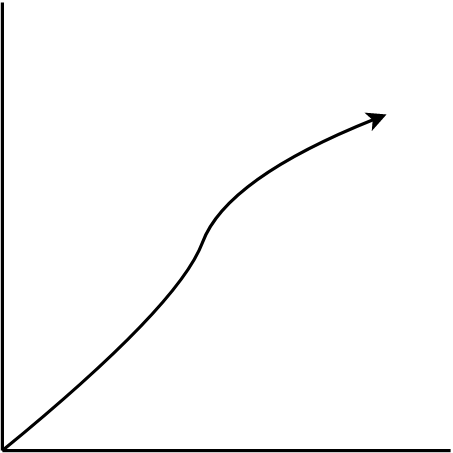
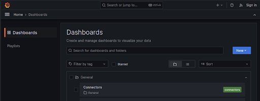
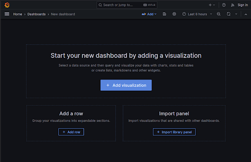
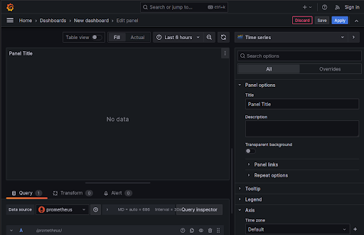
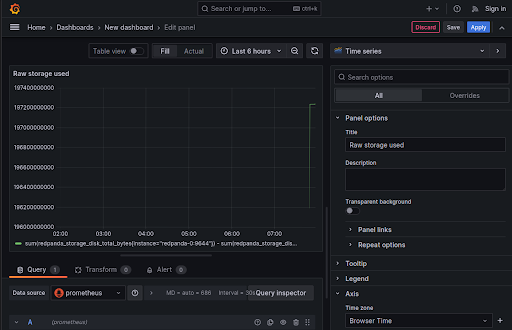
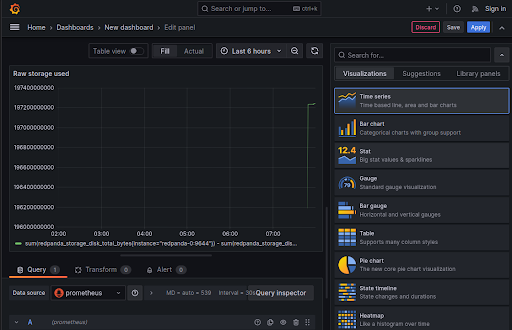

## Create a custom visualization

Let's create a line chart focused on storage used. This chart will show a single growing from the bottom-left to top-right, like this example:



First we need to find the metrics tied to storage, and one of the best ways to find this is by looking at some of the existing related charts.

Open Redpanda Default Dashboard, then expand the storage section at the bottom of the page:


The chart named Disk storage bytes free is close to what we want:


But it has a few issues:
1. The y-axis could be improved
2. This shows the amount of free space rather than the disk used

Let's create a new dashboard, and then create two charts based on similar data as this. The modification will be to subtract the current value shown from `redpanda_storage_disk_total`. This will give a constantly-increasing value that can be used to draw the line chart we want.

Click the toggle menu in the top left and then choose "Dashboards". Then click the blue "New" button in the top right and choose "New Dashboard":



You will then see your new (empty) dashboard:



Now click "Add visualization", and on the next screen choose the Prometheus data source. You will then see the following chart details:



Take the following actions:

- In "Panel options" section, update the title to "Raw storage used"
- In the "Axis" section, update the time zone
- In the "Standard options" section, set unit to "Number" (found under "Misc")
- In the "Query" tab at the bottom, set the formula to the following:

```
sum(redpanda_storage_disk_total_bytes{instance="redpanda-0:9644"}) - sum(redpanda_storage_disk_free_bytes{instance="redpanda-0:9644"})
```

> Note: You may have to change the query mode from "Builder" to "Code" to see the PromQL input field.

You should now see a blue "Run queries" button just above the PromQL input field. Clicking that button will show the line chart we want:



Click Apply in the top right corner, and your chart will be shown in your new dashboard.

We can make this value easier to see by creating another chart using the "Stat" visualization. Click the ellipses in the top right of the chart, then choose More > Duplicate


Now choose Edit on the new chart. In the top right corner, change "Time series" to "Stat":



You can also scroll down to the Thresholds section and change the number `80` on the red entry to something higher than the current value:

```
15000000000
```

> Note: A helpful way to use thresholds is to have them match the value of any alerts created.

Your new dashboard should look something like this:


Make sure to save your new charts and dashboard by clicking the "Save" icon in the top right (otherwise all your progress could be lost). Name your dashboard "Storage" and save it in the "General" folder.

