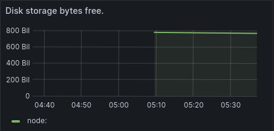
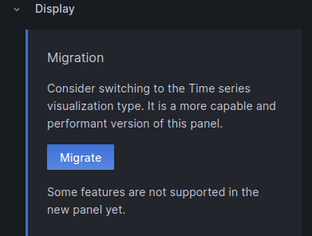
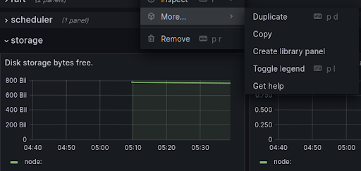

## Create a custom visualization

Let's create a line chart focused on storage used. This chart will show a single growing from the bottom-left to top-right, like this example:


First we need to find the metrics tied to storage, and one of the best ways to find this is by looking at some of the existing related charts. Open Redpanda Default Dashboard, then expand the storage section at the bottom of the page.


The chart named Disk storage bytes free is close to what we want:



But it has a few issues:
1. The y-axis could be improved
2. This shows the amount of free space rather than the disk used

Let's create a new dashboard, and then create two charts based on similar data as this. The modification will be to subtract the current value shown from `redpanda_storage_disk_total`. This will give a constantly-increasing number that can be used to draw the line chart we want.


You will then see your new (empty) dashboard:


Now click "Add visualization", and on the next screen choose the Prometheus data source. You will then see the following chart details:


Take the following actions:

- Update the Title to "Raw storage used"
- Choose "Migrate" from the display section



- Update the time zone in the Axis section
- Set Unit to "Number" in the "Standard options" section
- Set the formula to the following:

```
sum(redpanda_storage_disk_total_bytes{instance="redpanda-0:9644"}) - sum(redpanda_storage_disk_free_bytes{instance="redpanda-0:9644"})
```

You should now see a blue "Run queries" button just above the formula input field. Clicking that button will show the line chart we want:


Click Apply in the top right corner, and your chart will be shown in your new dashboard.

We can make this value easier to see by creating another chart using the "Stat" visualization. Click the ellipses in the top right of the chart, then choose More > Duplicate



Now choose Edit on the new chart. In the top right corner, change "Time series" to "Stat":


You can also scroll down to the Thresholds section and change the number `80` on the red entry to:

```
180000000000
```

This will match the value of the alert we will create in the next step. Your new dashboard should look something like this:


Make sure to click the "Save" icon in the top right and give your dashboard a new name (we'll use the name "Storage" and save it in the "General" folder).

